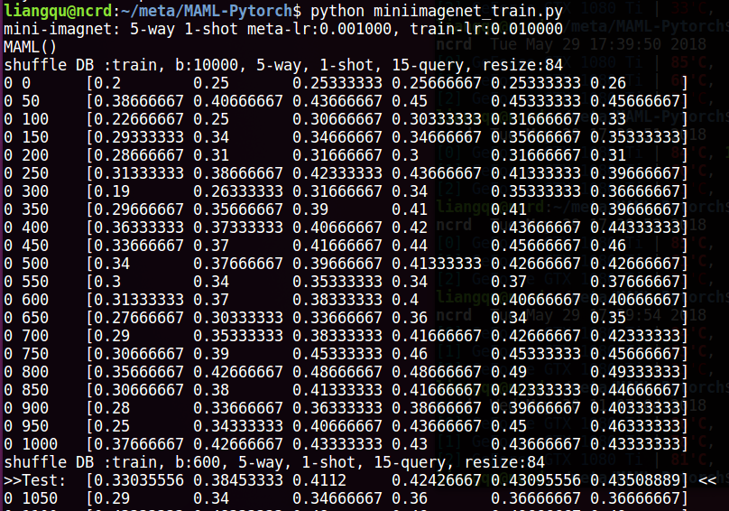

#  MAML-Pytorch
PyTorch implementation of the supervised learning experiments from the paper:
[Model-Agnostic Meta-Learning (MAML)](https://arxiv.org/abs/1703.03400).

> Version 1.0: Both `MiniImagenet` and `Omniglot` Datasets are supported! Have Fun~

> Version 2.0: Re-write meta learner and basic learner. Solved some serious bugs in version 1.0.

For Tensorflow Implementation, please visit [HERE](https://github.com/dragen1860/MAML-TensorFlow).

For First-Order Approximation Implementation, Reptile namely, please visit [HERE](https://github.com/dragen1860/Reptile-Pytorch).

# Platform
- python: 3.x
- Pytorch: 0.4+

# MiniImagenet


## Howto

1. download `MiniImagenet` dataset from [here](https://github.com/dragen1860/LearningToCompare-Pytorch/issues/4), splitting: `train/val/test.csv` from [here](https://github.com/twitter/meta-learning-lstm/tree/master/data/miniImagenet).
2. extract it like:
```shell
miniimagenet/
├── images
	├── n0210891500001298.jpg  
	├── n0287152500001298.jpg 
	...
├── test.csv
├── val.csv
└── train.csv


```
3. modify the `path` in `miniimagenet_train.py`:
```python
        mini = MiniImagenet('miniimagenet/', mode='train', n_way=args.n_way, k_shot=args.k_spt,
                    k_query=args.k_qry,
                    batchsz=10000, resize=args.imgsz)
		...
        mini_test = MiniImagenet('miniimagenet/', mode='test', n_way=args.n_way, k_shot=args.k_spt,
                    k_query=args.k_qry,
                    batchsz=100, resize=args.imgsz)
```
to your actual data path.

4. just run `python miniimagenet_train.py` and the running screenshot is as follows:


## Benchmark

| Model                               | Fine Tune | 5-way Acc. |        | 20-way Acc.|        |
|-------------------------------------|-----------|------------|--------|------------|--------|
|                                     |           | 1-shot     | 5-shot | 1-shot     | 5-shot |
| Matching Nets                       | N         | 43.56%     | 55.31% | 17.31%     | 22.69% |
| Meta-LSTM                           |           | 43.44%     | 60.60% | 16.70%     | 26.06% |
| MAML                                | Y         | 48.7%      | 63.11% | 16.49%     | 19.29% |
| **Ours**                            | Y         | 48.1%      | 62.2%	| -    		 | - 	|


# Ominiglot

## Howto
run `python omniglot_train.py`, the program will download `omniglot` dataset automatically.

decrease the value of `args.task_num` to fit your GPU memory capacity.


# Refer to this Rep.
```
@misc{MAML_Pytorch,
  author = {Liangqu Long},
  title = {MAML-Pytorch Implementation},
  year = {2018},
  publisher = {GitHub},
  journal = {GitHub repository},
  howpublished = {\url{https://github.com/dragen1860/MAML-Pytorch}},
  commit = {master}
}
```
